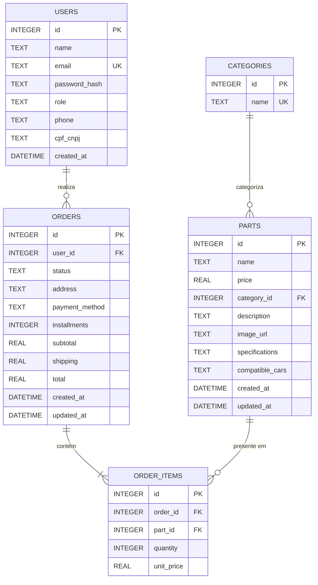

# Diagrama Entidade-Relacionamento — AutoHub

## Diagrama Mermaid

## Descrição das Entidades

### Users (Usuários)
Armazena todos os usuários do sistema. O campo `role` define o perfil (`user` ou `admin`). A senha é armazenada como hash bcrypt.

### Categories (Categorias)
Tabela de categorias de peças: Motor, Freios, Suspensão, Elétrica, Rodas, Manutenção.

### Parts (Peças)
Entidade principal do CRUD. Contém informações da peça incluindo `specifications` e `compatible_cars` armazenados como JSON text.

### Orders (Pedidos)
Registra cada compra feita por um usuário. O `status` segue o fluxo: Processando → Enviado → Entregue (não é possível voltar).

### Order_Items (Itens do Pedido)
Tabela associativa entre `orders` e `parts`. Registra a quantidade e o preço unitário no momento da compra.

## Relacionamentos

| Relação | Tipo | Descrição |
|---------|------|-----------|
| Users → Orders | 1:N | Um usuário pode ter vários pedidos |
| Categories → Parts | 1:N | Uma categoria agrupa várias peças |
| Orders → Order_Items | 1:N | Um pedido contém vários itens |
| Parts → Order_Items | 1:N | Uma peça pode aparecer em vários pedidos |
