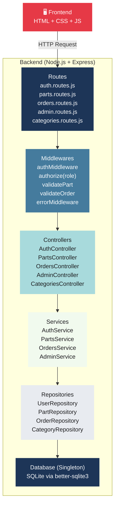
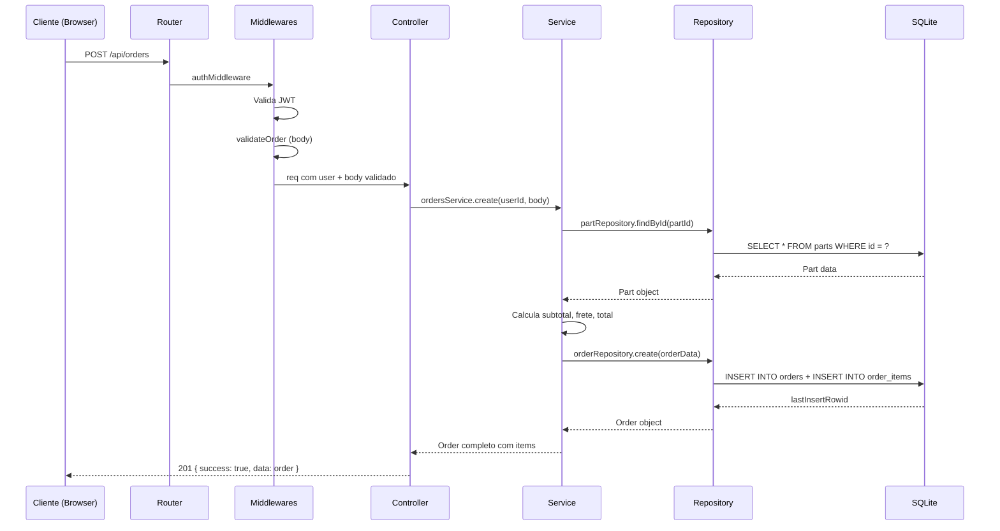
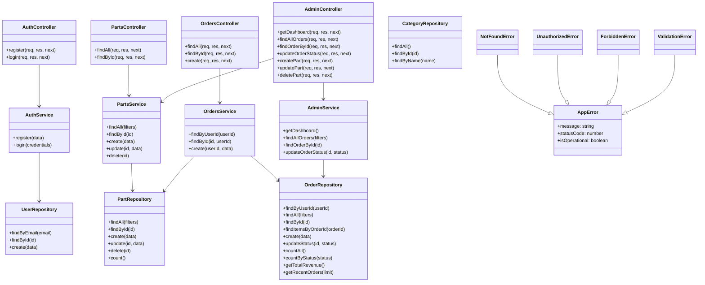

# Diagrama Estrutural — AutoHub

## Arquitetura em Camadas

## Fluxo de uma Requisição

## Diagrama de Classes (Simplificado)

## Responsabilidade de Cada Camada

| Camada | Responsabilidade | Exemplo |
|--------|-----------------|---------|
| **Routes** | Mapear URL + verbo HTTP → middleware → controller | `router.get('/parts/:id', partsController.findById)` |
| **Middlewares** | Verificações transversais antes do controller | `authMiddleware`, `authorize('admin')`, `validatePart` |
| **Controllers** | Receber req, chamar service, retornar response com status correto | `res.status(201).json({ success: true, data })` |
| **Services** | Lógica de negócio, regras, cálculos | Calcular frete, validar fluxo de status |
| **Repositories** | Queries SQL, CRUD no banco | `db.prepare('SELECT ...').all()` |
| **Database** | Conexão única com SQLite (Singleton) | `module.exports = db` |
